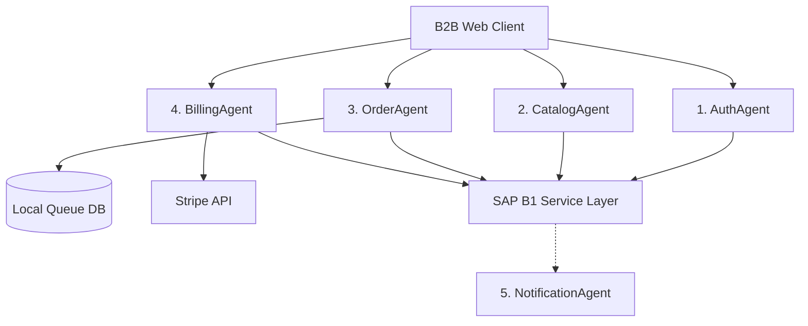

# 🏺 B2B Customer Self-Service Portal
## Agent-Based System Architecture & Integration Workflow

This architectural blueprint outlines the design of a secure, scalable B2B Customer Self-Service Portal integrated with the **SAP Business One Service Layer**. The backend is structured around a decoupled **Agent-Based Architecture** where dedicated software agents manage isolated segments of the business logic.

---

## 🔒 Strict Agent Governance Protocol
> [!IMPORTANT]
> **GOVERNANCE RULE:** All software agents defined in this system must strictly follow their predefined sequence of tasks. Under no circumstances is an agent permitted to alter, bypass, or mutate any step in the transaction pipelines without explicit human-developer or administrator permission. This enforces strict audit trails and compliance.

---

## 1. System Agent Definitions

The system is split into **five specialized service agents**. Each agent is decoupled, communicates via events or structured APIs, and operates within strict boundaries.

### 🔑 Agent 1: Authentication & Session Agent (`AuthAgent`)
*   **Role:** Manages secure gateway access and maps client identities to SAP Business One accounts.
*   **Responsibilities:**
    *   Authenticating portal users against local credential hashes.
    *   Mapping logged-in users to their corresponding **SAP B1 Business Partner (BP) CardCode**.
    *   Handling JWT token generation, refresh intervals, and session security.

### 📦 Agent 2: Price & Catalog Sync Agent (`CatalogAgent`)
*   **Role:** Handles customer-specific pricing and inventory visibility.
*   **Responsibilities:**
    *   Fetching item catalogs from the SAP B1 Item Master.
    *   Mapping custom B2B pricing dynamically by querying the specific **SAP B1 Price List ID** assigned to the customer's CardCode.
    *   Reading real-time warehouse stock levels to prevent overselling.

### 🛒 Agent 3: Order Placement & Queue Agent (`OrderAgent`)
*   **Role:** Manages bulk order submittals, credit checks, and delivery queuing.
*   **Responsibilities:**
    *   Performing a pre-checkout **Credit Limit Check** against the customer's account in SAP B1.
    *   Validating order payload integrity (correct SKU formatting, quantities).
    *   Writing successfully validated orders to a local failover queue.
    *   Pushing queued orders to the SAP B1 Service Layer to create a **Sales Order** document.

### 💳 Agent 4: Invoice & Payment Agent (`BillingAgent`)
*   **Role:** Manages outstanding ledgers and processes electronic payments.
*   **Responsibilities:**
    *   Retrieving open **A/R Invoices** and customer account balances from SAP B1.
    *   Interfacing with the Stripe/PayPal APIs to securely process invoice payments.
    *   Creating **Incoming Payment** records in SAP B1 upon successful transaction processing to clear outstanding invoices.

### 🔔 Agent 5: Auditing & Notification Agent (`NotificationAgent`)
*   **Role:** Handles event logging, email dispatch, and system health.
*   **Responsibilities:**
    *   Recording audit trails of all write actions performed by other agents.
    *   Dispatching confirmation emails (orders received, invoices paid).
    *   Monitoring SAP B1 API connection health and alerting admins on critical drops.

---

## 2. Step-by-Step Transaction Workflows

### Workflow A: Bulk Order Processing (`OrderAgent` Pipeline)
1.  **Step 1: Receive Payload:** `OrderAgent` receives the wholesale shopping cart list from the client portal.
2.  **Step 2: Check Account Status:** Query SAP B1 to check if the Business Partner (BP) is active and has sufficient credit limit.
    *   *If failed:* Halt order and notify client of account hold.
3.  **Step 3: Verify Stock:** Check real-time warehouse quantities in SAP B1 for all ordered SKUs.
    *   *If insufficient:* Flag item and prompt client to adjust quantity.
4.  **Step 4: Queue Order:** Write the validated order payload to the local relational database queue (SQLite/SQL Server).
5.  **Step 5: POST to SAP B1:** Send the payload via the Service Layer REST API to `/b1s/v1/Orders`.
6.  **Step 6: Confirm and Clear:** Upon receiving HTTP `201 Created` from SAP, update the local queue status to `Synced` and log the SAP Sales Order Document Entry ID.

### Workflow B: Invoice Payment (`BillingAgent` Pipeline)
1.  **Step 1: Fetch Invoices:** Retrieve all unpaid `OINV` (A/R Invoice) records linked to the customer's `CardCode`.
2.  **Step 2: Generate Stripe Session:** Create a secure payment session matching the exact invoice balance.
3.  **Step 3: Process Payment:** Wait for the Stripe webhook confirmation.
4.  **Step 4: Create SAP Posting:** On successful webhook, generate an **Incoming Payment** JSON payload.
5.  **Step 5: POST Ledger Entry:** Send the payload via the Service Layer REST API to `/b1s/v1/IncomingPayments` to match and close the paid A/R Invoice.
6.  **Step 6: Audit Record:** Log the transaction hash and close the invoice status on the portal dashboard.

---

## 3. Scale & Maintenance Guidelines for Developers

*   **Decoupled Services:** Do not write direct database calls in the frontend. All interactions must go through the dedicated agent controllers.
*   **Encapsulated Credentials:** Never hardcode SAP B1 database passwords or Service Layer logins. All configurations must be read from environment variables (`AppSettings.json` or Key Vaults).
*   **Idempotency Keys:** Every Sales Order or Payment posting must use an Idempotency Key (usually the local portal Order ID) to prevent duplicate documents from being created in SAP B1 in case of network retries.
